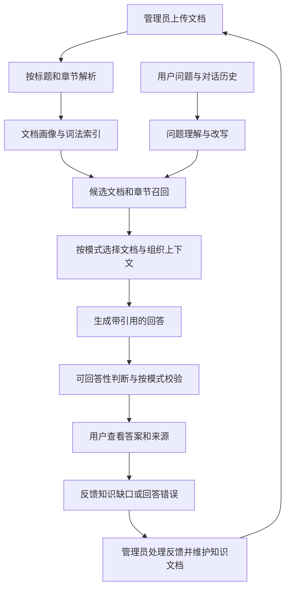

# rag-ai · 企业知识库问答系统

**把少量、高价值文档变成可提问、可追溯、可持续维护的知识库。**

rag-ai 是一个可自行部署的非向量化 RAG 项目。它通过精确匹配、中文词法检索、PostgreSQL `pg_trgm` 和 LLM 文档画像查找证据，再生成附带引用的回答。无需 Embedding 服务或向量数据库。

项目包含用户聊天界面和管理后台，覆盖文档维护、账号管理、对话审计、问题反馈与模型用量统计。公开仓库仅包含源码、文档和虚构示例，不包含原项目的内部资料、运行数据或历史提交。

[快速开始](#快速开始) · [使用指南](docs/usage.md) · [配置说明](docs/configuration.md) · [架构设计](docs/architecture.md) · [常见问题](docs/troubleshooting.md)

## 项目定位

适合文档数量较少、内容价值较高、需要核对来源的团队知识问答，例如产品说明、项目资料、操作手册和常见问题。它也适合作为研究“文档解析 → 检索 → 上下文组织 → 回答校验”完整链路的学习项目。

与只按固定长度切块的实现相比，本项目优先保留文档和章节结构：选中的小文档尽量全文进入上下文，大文档使用相关章节和相邻内容，减少遗漏条件、备注与例外的机会。

当前定位是**单个组织共享知识库**。用户的会话与用量按账号隔离，但没有实现按部门或用户配置文档访问权限，也没有提供海量文档与高并发场景的容量保证。

## 功能概览

| 模块 | 已有能力 |
| --- | --- |
| 文档导入 | PDF、DOCX、TXT、Markdown、XLSX；提取正文、标题层级、章节和可用页码 |
| 文档维护 | 查看正文、编辑、重新解析、启用/停用、删除、生成文档画像 |
| 检索 | 精确匹配、中文词法检索、pg_trgm 索引、文档画像辅助召回 |
| 上下文 | 小文档全文、大文档章节检索、相邻章节和同父章节扩展、字符预算控制 |
| 问答 | fast / standard / deep 模式，多轮对话、流式输出、停止生成、重新生成 |
| 引用 | 回答中的编号引用，来源列表展示文档名、章节和可用页码 |
| 问题反馈 | 知识不足和回答有误反馈、相似问题合并、分组建议、处理状态与标准答案 |
| 用户管理 | 管理员创建账号、重置密码、删除用户；普通用户独立登录 |
| 审计与用量 | 管理员查看用户会话、调用记录及 Token 用量；用户查看自己的用量 |
| 模型配置 | 通过 OpenAI 兼容接口接入模型，支持后台修改配置与连接测试 |

## 工作原理



三种模式共用解析、检索、引用和用量记录。区别主要在回答前后的处理步骤：

| 模式 | 主要策略 | 适合的问题 |
| --- | --- | --- |
| `fast` | 使用排名靠前的候选文档和章节，简化后续筛选，不扩展相邻章节 | 明确的事实、日期、编号查询 |
| `standard` | LLM 选择相关文档，并扩展相邻章节 | 需要结合条件或上下文的日常问答 |
| `deep` | 增加查询扩展、章节重排与证据校验 | 跨文档比较、综合归纳、较复杂的问题 |
| `auto` | 根据问题分析结果选择上述模式 | 作为后台默认策略使用 |

模式优先级为：**请求显式指定 > 后台默认模式 > auto 的问题复杂度判断**。更复杂的模式通常需要更多调用，实际耗时和费用取决于模型、资料长度与检索结果；项目没有承诺固定调用次数或准确率。

## 技术栈

| 层 | 实现 |
| --- | --- |
| 前端 | React 19、TypeScript、Vite、Tailwind CSS |
| 后端 | Python 3.11+、FastAPI、Pydantic |
| 数据库 | PostgreSQL 16、pg_trgm、asyncpg 连接池 |
| 模型 | OpenAI 兼容 Chat Completions 接口 |
| 文档解析 | pypdf、python-docx、openpyxl |
| 部署 | Docker Compose；或构建前端后由 FastAPI 统一托管 |

## 快速开始

### 1. 获取源码

```bash
git clone https://github.com/aid2301/rag-ai.git
cd rag-ai
```

### 2. 准备配置

Docker 方式只需要 Docker Engine / Docker Desktop 和 Docker Compose v2，本机无需另装 Python、Node.js 或 PostgreSQL。先确认 Docker 引擎已经启动。

macOS / Linux：

```bash
cp .env.example .env
```

Windows PowerShell：

```powershell
Copy-Item .env.example .env
```

编辑 `.env`，为 `PG_PASSWORD` 和 `ADMIN_PASSWORD` 分别设置自己的密码。Compose 会在缺少这两项时拒绝启动。不要把真实配置文件提交到仓库。

模型参数可以先留空，启动后在后台配置。暂不配置模型时，可以进入管理界面，但无法完成正常的模型问答。

### 3. 启动

```bash
docker compose up -d --build
docker compose ps
```

首次启动需要下载镜像和安装依赖。服务启动后访问：

| 入口 | 地址 |
| --- | --- |
| 用户界面 | <http://localhost:8000> |
| 管理后台 | <http://localhost:8000/#/admin> |
| API 文档 | <http://localhost:8000/docs> |
| 健康状态 | <http://localhost:8000/api/health> |

管理员账号为 `admin`，密码是你填写的 `ADMIN_PASSWORD`。普通用户账号由管理员创建，没有公开注册入口。

### 4. 完成第一次问答

1. 登录管理后台，进入模型设置，填写 Base URL、API Key、Model 并测试连接。
2. 上传 [虚构演示文档](examples/documents/demo-guide.md)，等待文档变为可用状态。
3. 在用户管理中创建一个普通用户。
4. 回到用户界面，用新账号登录并提问“星桥项目什么时候演示？”。
5. 展开“参考来源”，核对文档名与章节；示例资料中的日期是 **2030 年 5 月 12 日**。

还可以追问“演示样品可以借用多久？”或提出资料未包含的问题，观察引用和知识不足反馈。完整流程见 [使用指南](docs/usage.md)。

## 本地开发

需要 Python 3.11+、Node.js 24+ 和 PostgreSQL 16。先按上方步骤准备 `.env`，然后只启动数据库：

```bash
docker compose up -d db
python -m venv .venv
```

激活 Python 环境：

```powershell
# Windows PowerShell
.venv\Scripts\Activate.ps1
```

```bash
# macOS / Linux
source .venv/bin/activate
```

安装依赖并启动前后端：

```bash
python -m pip install -r backend/requirements-dev.txt
npm --prefix frontend ci
python scripts/dev.py
```

开发前端为 <http://localhost:5173>，API 为 <http://localhost:8000/docs>。Vite 将 `/api` 请求代理到后端。按 `Ctrl+C` 结束开发启动脚本。

根目录的 `start-dev.bat` 和 `start.sh` 是快捷入口；也可以在两个终端分别运行：

```bash
# 终端 1，项目根目录
python -m uvicorn app.main:app --app-dir backend --host 127.0.0.1 --port 8000 --reload
# 终端 2，项目根目录
npm --prefix frontend run dev
```

开发脚本固定使用 8000/5173 端口。手动修改后端端口时，需要同步调整 `frontend/vite.config.ts` 的代理目标。更多说明见 [开发指南](docs/development.md)。

## 配置要点

| 配置项 | 作用 |
| --- | --- |
| `ADMIN_PASSWORD` | 管理员密码；部署前必须自行设置 |
| `PG_*` / `DATABASE_URL` | 数据库地址、账号和密码；Compose 内部连接由服务配置管理 |
| `LLM_BASE_URL` / `LLM_API_KEY` / `LLM_MODEL` | 模型连接默认值，也可在后台设置 |
| `SECRET_KEY` | 登录令牌签名密钥；留空时在 `data/secret_key` 自动生成并持久化 |
| `DEFAULT_CHAT_MODE` | 默认 `auto`，也可以设置为 `fast`、`standard` 或 `deep` |
| `SHOW_THINKING` | 是否在页面展示执行阶段，默认关闭 |
| `MAX_UPLOAD_SIZE_MB` | 单文件上传上限，默认 50 MB |
| `FULL_DOCUMENT_MAX_CHARS` | 小文档全文策略阈值，默认 12000 字符 |
| `CONTEXT_BUDGET_CHARS` | 证据正文总预算，默认 28000 字符 |

**后台已保存的模型配置优先于环境变量默认值。** 如果修改 `.env` 后模型没有变化，请先检查后台设置。完整参数、优先级和重启方式见 [配置说明](docs/configuration.md)。

## 数据与使用边界

- **公开仓库与运行数据分离。** 上传文档、数据库、密钥、日志和内部材料不纳入公开提交；示例文档与测试中的业务内容都是虚构的。
- **自行部署不等于模型调用完全离线。** 文档画像、问答等步骤会向你配置的模型端点发送所需正文、问题或历史上下文。处理敏感资料前，应选择符合自身数据要求的模型服务和部署方式。
- **共享知识库，隔离个人会话。** 普通用户不能管理文档，但问答可使用共享知识库；管理员可以审计用户会话。当前没有多租户、部门级文档权限或企业 SSO。
- **有引用仍需核验。** 引用列表提供文档、章节和可用页码，不是逐句事实正确性的保证；页面中的执行阶段也不是模型内部推理内容。

## 文件格式与限制

| 格式 | 当前处理方式与限制 |
| --- | --- |
| PDF | 提取文字并保留页码；不内置 OCR，纯扫描件应先转换为可提取文字的文档 |
| DOCX | 读取段落、标题样式和表格；不保证还原复杂排版、图片或文本框内容 |
| TXT / Markdown | 按文本与标题结构解析，适合清晰分节的说明资料 |
| XLSX | 每个工作表转为 Markdown 表格；每表最多输出前 500 个非空行，包含表头；读取公式缓存值，不执行公式计算 |

不支持旧版 `.doc` / `.xls`、图片、音视频直接入库。上下文字符预算不等于模型 Token 上限；长文档或多文档结果可能被截断。大量文档、复杂表格和高并发需求应先用自身样本验证。

## 测试与评估

### 自动化检查

测试不需要真实模型凭据。数据库测试使用独立的临时 PostgreSQL，宿主端口 55433，与应用数据库的 55432 分离：

```bash
docker compose -f compose.test.yml up -d --wait
cd backend
python -m pytest -q
cd ../frontend
npm test
npm run lint
npm run build
cd ..
docker compose -f compose.test.yml down
```

`TEST_DATABASE_URL` 必须指向以 `_test` 结尾的专用测试库。测试会重建其中的 public schema，不能指向需要保留的数据。无数据库时的独立测试命令见 [开发指南](docs/development.md)。

[GitHub Actions 配置](docs/ci.md) 目前作为模板提供，尚未启用自动运行。模板包含后端测试、前端检查和 Docker 构建。

### 真实模型评估

先导入示例文档并配置模型，再运行：

```bash
python scripts/evaluate.py --mode fast
python scripts/evaluate.py --mode deep --out eval_report_deep.json
```

默认使用 [评估集](examples/evaluation.json)，也可通过 `--dataset` 传入自己的 JSON 文件。旧入口 `python evaluate.py` 仍可使用。评估会调用配置的真实模型并产生 Token 用量，报告可能含回答和来源，请保存在本地。

报告统计关键词答案命中、来源命中、禁词命中风险、耗时和 Token 用量。它适合比较同一测试集上的变化，**不等同于人工评估的准确率或真实幻觉率**，尤其不能仅凭“没有禁词”判定拒答正确。

## 项目结构

```text
rag-ai/
├── backend/
│   ├── app/
│   │   ├── api/routes/      HTTP 接口与权限检查
│   │   ├── core/            配置、认证、日志
│   │   ├── db/              连接池、SQL 适配、表结构与迁移
│   │   ├── prompts/         模型提示词
│   │   ├── schemas/         API 数据模型
│   │   └── services/        文档、检索、RAG、LLM、用户等业务逻辑
│   └── tests/              自动化测试与专用数据库工具
├── frontend/
│   ├── src/api/            按业务领域拆分的客户端与 SSE 解码
│   ├── src/components/     通用组件和聊天组件
│   ├── src/pages/          用户端与管理端页面
│   └── tests/              直接调用 API 模块的流式测试
├── scripts/                开发启动与模型评估
├── examples/               虚构资料与评估集
├── docs/                   使用、配置、架构、开发和部署文档
├── .github/                GitHub Actions 模板
├── docker-compose.yml      应用与数据库服务
├── compose.test.yml        独立临时测试数据库
└── .env.example            不含真实凭据的配置模板
```

## 文档导航

| 你想做什么 | 文档 |
| --- | --- |
| 从导入资料到处理用户反馈 | [使用指南](docs/usage.md) |
| 设置模型、端口和检索参数 | [配置说明](docs/configuration.md) |
| 理解模块与检索链路 | [架构设计](docs/architecture.md) |
| 修改代码和运行测试 | [开发指南](docs/development.md) |
| 部署、更新与维护容器 | [Docker 部署](docs/deployment/docker.md) |
| 在 Windows 服务中运行 | [Windows 部署](docs/deployment/windows.md) |
| 处理启动、登录、上传和回答问题 | [常见问题](docs/troubleshooting.md) |

## 贡献与许可证

欢迎通过 [Issues](https://github.com/aid2301/rag-ai/issues) 反馈问题，通过 Pull Request 提交改进。请提供可复现步骤和虚构样例，去除真实文档、令牌和个人信息；具体约定见 [贡献指南](CONTRIBUTING.md)。

本项目采用 [MIT License](LICENSE)。第三方依赖和所接入模型服务仍适用其各自的许可证或服务条款。
