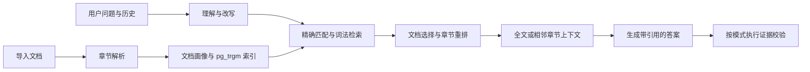

# 架构

## 后端边界

`app/main.py` 只组装路由、生命周期和静态页面服务。`api/routes` 校验参数与权限，`services` 承担业务操作，`prompts` 保存模型提示词。`db/schema_pg.py` 定义新库表结构，`db/migrations.py` 负责既有库的幂等升级。

`db/database.py` 管理 asyncpg 连接池，`pg_conn.py` 将业务 SQL 的问号占位符转换为 PostgreSQL 占位符。连接按每次方法调用获取和释放；多次调用不是一个事务，需要原子性的新功能应显式使用同一连接的事务。

测试数据库初始化与清理放在 `backend/tests/db_helpers.py`，生产应用不包含清库入口。`TEST_DATABASE_URL` 与应用配置独立。

## 检索与回答

fast、standard、deep 由后台默认模式或请求选择。文档、画像、会话、问题反馈、用户和用量保存在 PostgreSQL；上传文件与签名密钥保存在 `data/`。

## 前端边界

`src/api/` 按 auth、documents、conversations、chat、questions、admin、settings、usage 划分业务客户端，`http.ts` 提供通用请求。`src/api.ts` 是兼容导出，页面无需了解模块位置。

`sse.ts` 处理 UTF-8 跨块、LF/CRLF 分帧、终止事件和读取器释放。事件顺序为 meta → stage/delta → done 或 error。意外断流会报错，避免把半截回答当作完成。

## 配置与运行

静态配置按进程环境变量 → `backend/.env` → 根目录 `.env` → 代码默认值读取。后台数据库中保存的模型配置优先于这些默认值；字符串空值的回退规则见 [配置说明](configuration.md)。`SECRET_KEY` 同样由配置模块读取；为空时生成并保存到 `data/secret_key`。

权限校验在服务端执行，普通用户只能访问自己的会话与用量。管理员负责文档和用户管理，并可审计对话。演示 UI 展示的是执行阶段，不是模型内部推理。
